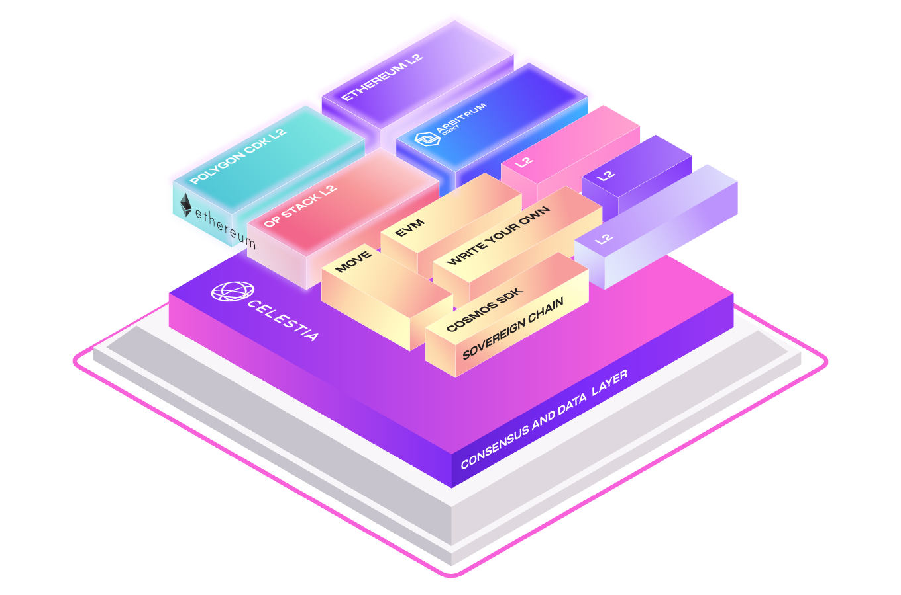

# Quickstart

<figure><figcaption></figcaption></figure>

## **Quick Start Guide for Celestia Nodes (Mocha-4 / Testnet)**

Welcome to the Quick Start guide for setting up Celestia nodes on the Mocha-4 testnet. This guide will walk you through the prerequisites, installation of necessary tools, and running the Ansible playbooks for setting up Celestia Validator and Bridge nodes.

***

### **1. Prerequisites**

Before starting, ensure you meet the following requirements:

#### **Hardware Requirements**

* **Validator Node**:
  * 8 CPU Cores
  * 16GB RAM
  * 2TB NVME&#x20;


RAID 0 or ZFS is recommended with no compression


* **Bridge Node**&#x20;
  * 12 CPU Cores
  * 64GB RAM (minimum recommended for ZFS)
  * 6TB+ NVME storage (use ZFS compression for efficiency)


RAID 0 or ZFS is recommended with 2x compression


#### **Operating System**

* Ubuntu 20.04 (or later)

#### **Software Requirements**

* Ansible installed on your local machine.
* Target servers must be accessible via SSH using a key (password login should be disabled for security).

***

### **2. Installation and Setup**

#### **Step 1: Install Ansible**

First, ensure that Ansible is installed on your local machine. If it's not already installed, use the following commands to set it up on Ubuntu:

```bash
apt update
sudo apt install ansible
```

#### **Step 2: Clone the Celestia Ansible Playbooks**

Clone the playbooks repository to your local machine:

```bash
git clone https://github.com/geoddllc/celestia-ansible-playbook
cd celestia-ansible-playbooks
```

#### **Step 3: Configure the Ansible Hosts File**

Edit the `hosts.ini` file to match your server setup. Example:

```ini
[validator]
primary-server ansible_host=172.16.0.18 ansible_user=ubuntu ansible_ssh_private_key_file=~/.ssh/id_rsa

[bridge]
secondary-server ansible_host=192.168.100.2 ansible_user=ubuntu ansible_ssh_private_key_file=~/.ssh/id_rsa
```

Make sure to replace the `ansible_host` and `ansible_user` with your server’s IP address and username.

***

### **3. Setting Up Nodes**

#### **Step 1: Running the Validator Node Playbook**

To set up a Celestia Validator node on the primary server, run the following command:

```bash
ansible-playbook -i hosts.ini playbooks/setup_celestia-validator.yml -l primary-server
```

This will install all necessary dependencies, including Go and Celestia binaries, and configure your Validator node.

#### **Step 2: Running the Bridge Node Playbook**

To set up a Celestia Bridge node, run the following command:

```bash
ansible-playbook -i hosts.ini playbooks/setup_bridge_node.yml -l secondary-server
```

This sets up the Bridge node, which connects the Celestia network to the data availability layer (DA).

